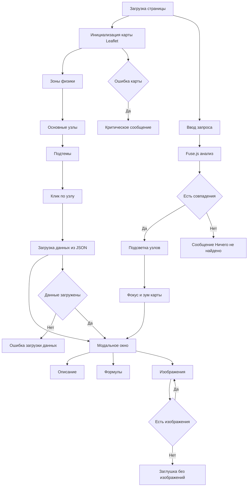

<div align="center">

# ⚛️ Phys-Lab  
### Интерактивная карта физики и система навигации по научным понятиям

🔭 Образовательный веб-проект для визуального изучения физики: от классики до квантовой теории и будущих направлений науки.

---

[](https://phys-lab.ru)
[](https://github.com/DIBERLOG/map_fiziki)
[](https://github.com/DIBERLOG/map_fiziki/blob/main/LICENSE.md)
[](https://github.com/DIBERLOG/map_fiziki/blob/main/LICENSE.md#-получение-разрешения)

---

🛡️ **Лицензия проекта**  
Проект распространяется по лицензии **Phys-Lab License v1.0 (PLL-1.0)**.  
Использование, копирование и модификация материалов разрешены **только с письменного разрешения автора**.

</div>

---

## 🚀 Описание проекта

**Phys-Lab** — это интерактивная карта физики, представляющая науку в виде связанной системы областей, узлов и понятий.  
Проект ориентирован на **визуальное мышление**, систематизацию знаний и исследование связей между разделами физики.

Карта охватывает:
- классическую физику,
- квантовую механику,
- теорию относительности,
- термодинамику,
- философию и основания физики,
- перспективные и будущие направления науки.

---

## ✨ Основные возможности

✅ **Интерактивная карта физики**  
Физика представлена в виде зон, узлов и связей, отражающих логическую структуру науки.

✅ **Зоны знаний**  
Каждый крупный раздел (классика, квантовая физика, относительность и др.) выделен в отдельную зону карты.

✅ **Подтемы и узлы (300+ элементов)**  
Каждый узел содержит описание, формулы, изображения и междисциплинарные связи.

✅ **Модальные окна с данными**  
При клике открываются карточки с пояснениями, визуальными материалами и формулами.

✅ **Умный поиск по всей карте**  
Поиск работает сразу по:
- названиям тем,
- ключевым словам,
- формулам,
- философским и концептуальным понятиям.

✅ **Обработка ошибок и пустых состояний**  
Корректные сообщения при отсутствии данных, изображений или результатов поиска.

✅ **Адаптивный интерфейс**  
Корректная работа на компьютерах, планшетах и мобильных устройствах.

✅ **HTTPS и безопасность**  
Сайт работает по защищённому протоколу HTTPS с валидным SSL-сертификатом.

---

## 🧱 Технологический стек

<p align="center">

| Раздел | Технологии |
|------|------------|
| 🖥️ Frontend | HTML5, CSS3, JavaScript (ES6+) |
| 🗺️ Карта | Leaflet.js |
| 🔎 Поиск | Fuse.js |
| 🧠 Архитектура | Модульная структура JS |
| 🎨 UI/UX | Адаптивный дизайн, кастомные модальные окна |
| 🌐 Хостинг | GitHub Pages |
| 🌍 Домен | phys-lab.ru (Selectel DNS) |
| 🔒 Безопасность | HTTPS (SSL), CORS |
| 📁 Данные | JSON-структуры (узлы, зоны, формулы, связи) |

</p>

---

## 🧩 Структура проекта

```text
project/
│
├── index.html
│
├── css/
│   └── styles.css
│
├── js/
│   ├── core/
│   │   ├── map-init.js        # инициализация карты
│   │   ├── ui-controls.js    # управление интерфейсом
│   │   ├── modal-system.js   # модальные окна
│   │   ├── search.js         # умный поиск
│   │   └── connections.js   # связи между узлами
│   │
│   ├── data/
│   │   ├── zones.js          # зоны физики
│   │   ├── nodes.js          # основные узлы
│   │   ├── subtopics.js      # подтемы
│   │   └── categories.js    # категории и цвета
│
├── data/
│   └── modal_data/
│       ├── descriptions.json
│       ├── formulas.json
│       └── images.json
│
└── README.md
```
---
Логика взаимодействия карты, поиска и ошибок



---

<div align="center">

🛡️ Лицензия проекта
Phys-Lab является авторским образовательным проектом.
Любое использование материалов допускается только с согласия автора. [](https://github.com/DIBERLOG/map_fiziki/blob/main/LICENSE.md)

✨ Физика — это карта реальности, которую мы продолжаем дополнять. ✨

</div> 
